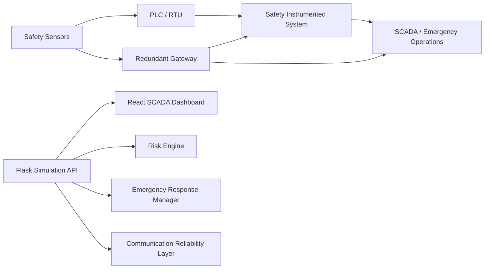
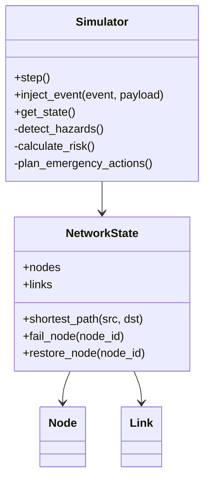
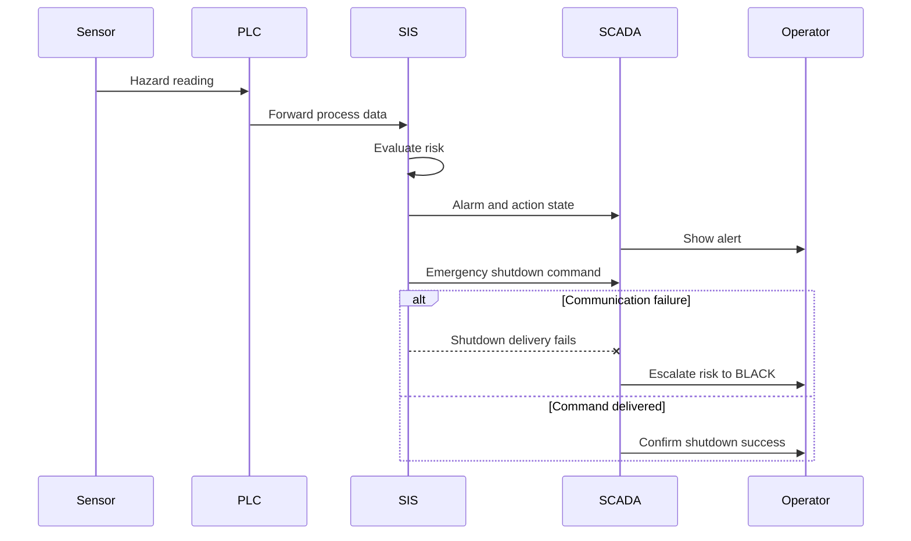

# Smart Industrial Safety Monitoring and Emergency Response Simulator

## 1. Complete Architecture

The project is a web-based SCADA-style safety simulator. The backend simulates sensors, plant hazards, industrial communication reliability, risk evaluation, emergency responses, alerts, and logs. The frontend renders the operator dashboard, scenario controls, sensor panels, risk meter, communication health, emergency actions, charts, and incident reporting.



## 2. Folder Structure

```text
backend/
  app.py
  routes.py
  simulator.py
  network.py
  tests/
frontend/
  src/
    App.tsx
    pages/
    components/
    types/
  tests/
```

The teammate-proposed modular folders can be introduced later if the backend grows further. For this implementation, the simulator is still compact and tested, so the safety modules are kept in `simulator.py` with clear internal sections.

## 3. API Endpoints

- `GET /network/status`: full dashboard state.
- `GET /api/status`: same state for API-style clients.
- `GET /api/metrics`: metric-only payload.
- `POST /api/simulate`: run a safety or communication scenario.
- `POST /simulate/failure`: fail a node by `nodeId`.
- `POST /simulate/restore`: restore a node by `nodeId`.
- `POST /simulate/link-failure`: fail a link by `source` and `target`.
- `POST /simulate/link-restore`: restore a link by `source` and `target`.
- `POST /simulate/random`: set random failure probability.
- `POST /reset` and `POST /api/reset`: reset simulation state.
- `GET /metrics/history`: time series data.
- `GET /alerts`: recent emergency alerts.
- `GET /logs`: recent incident logs.

## 4. Data Models

Primary dashboard state:

```json
{
  "plant": {},
  "sensors": [],
  "hazards": [],
  "risk": {},
  "emergency": {},
  "communication": {},
  "safetyMetrics": {},
  "nodes": [],
  "links": [],
  "metrics": {},
  "alerts": [],
  "logs": [],
  "history": []
}
```

Sensor model:

```json
{
  "id": "toxic_gas",
  "label": "Toxic Gas",
  "domain": "Chemical Plant",
  "value": 280.0,
  "unit": "ppm",
  "status": "online",
  "riskLevel": "RED",
  "normalRange": "0-40 ppm",
  "threshold": ">= 220 ppm"
}
```

## 5. UML Class Diagram



## 6. Sequence Diagram



## 7. React Components

- `PlantOverview.tsx`
- `SensorPanel.tsx`
- `RiskMeter.tsx`
- `HazardDetectionPanel.tsx`
- `CommunicationHealth.tsx`
- `EmergencyActions.tsx`
- `ReliabilityChart.tsx`
- `IncidentTimeline.tsx`
- `AlertPanel.tsx`
- `ScenarioControls.tsx`
- `NetworkMap.tsx`
- `IncidentReport.tsx`

## 8. Flask Backend Code Structure

- `app.py`: Flask app factory and CORS setup.
- `routes.py`: HTTP endpoints.
- `network.py`: industrial communication topology and routing.
- `simulator.py`: sensors, hazards, risk engine, emergency actions, communication reliability, scenario state, logs, and history.

## 9. Simulation Engine

Implemented scenarios:

- Chemical leak
- Radiation spike
- Methane explosion risk
- Reactor overheating
- Cooling system failure
- Tunnel fire
- Oxygen deficiency
- Pipeline failure
- PLC failure during emergency
- Communication loss during shutdown

Risk levels:

- `GREEN`: normal
- `YELLOW`: warning
- `ORANGE`: danger
- `RED`: critical
- `BLACK`: emergency shutdown required

## 10. Sample JSON Payloads

Run a chemical leak:

```json
{
  "event": "chemical_leak"
}
```

Run a communication-loss shutdown scenario:

```json
{
  "event": "communication_loss_shutdown"
}
```

Inject packet loss:

```json
{
  "event": "packet_loss",
  "rate": 0.08
}
```

Fail a PLC node:

```json
{
  "nodeId": "B"
}
```

## 11. Database Schema

The current simulator uses in-memory state for live demonstration. If persistence is required, use these tables:

```sql
CREATE TABLE incidents (
  id INTEGER PRIMARY KEY,
  scenario TEXT,
  risk_level TEXT,
  plant_safety_score REAL,
  created_at TEXT
);

CREATE TABLE sensor_readings (
  id INTEGER PRIMARY KEY,
  incident_id INTEGER,
  sensor_id TEXT,
  value REAL,
  unit TEXT,
  risk_level TEXT,
  recorded_at TEXT
);

CREATE TABLE emergency_actions (
  id INTEGER PRIMARY KEY,
  incident_id INTEGER,
  action_name TEXT,
  status TEXT,
  owner TEXT,
  eta_seconds REAL
);
```

## 12. Testing Strategy

- Backend unit tests validate network failover, metrics, safety scenarios, risk state, shutdown failure tracking, and API response shape.
- Frontend TypeScript build validates component and API model compatibility.
- Playwright smoke test validates that the safety console loads and key dashboard panels render.

## 13. Report Structure

1. Introduction
2. Problem statement
3. Industrial safety background
4. System architecture
5. Sensor simulation design
6. Hazard detection and risk engine
7. Emergency response simulation
8. Communication reliability as a safety layer
9. Dashboard implementation
10. Test cases and results
11. Limitations
12. Future scope
13. Conclusion

## 14. PPT Structure

1. Title and objective
2. Motivation: industrial hazard prevention
3. Target industries
4. Architecture diagram
5. Sensor and plant simulation
6. Risk levels
7. Emergency response flow
8. Communication reliability layer
9. Dashboard screenshots
10. Scenario demonstrations
11. Testing and results
12. Future scope

## 15. Viva Questions and Answers

**Q: Why is this not just a networking project?**  
A: The main objective is safety monitoring, hazard detection, risk scoring, and emergency response. Networking is used to model alarm and shutdown delivery reliability.

**Q: What does BLACK risk mean?**  
A: It means the condition requires emergency shutdown or an equivalent critical safety action.

**Q: How does packet loss affect safety?**  
A: Packet loss is treated as missed sensor readings or failed alarm/shutdown delivery, which can escalate risk.

**Q: Which industries are represented?**  
A: Chemical processing, nuclear power, mining, oil and gas, and hazardous manufacturing.

**Q: What is the role of the PLC and SIS?**  
A: The PLC receives field sensor data. The SIS evaluates safety logic and triggers protective actions such as shutdown.

## 16. Future Scope

- Persist incidents in SQLite or PostgreSQL.
- Add authentication and operator roles.
- Add configurable threshold profiles per industry.
- Add MQTT/WebSocket live streaming.
- Add 3D plant layout visualization.
- Add predictive maintenance models.
- Add exportable PDF incident reports.
